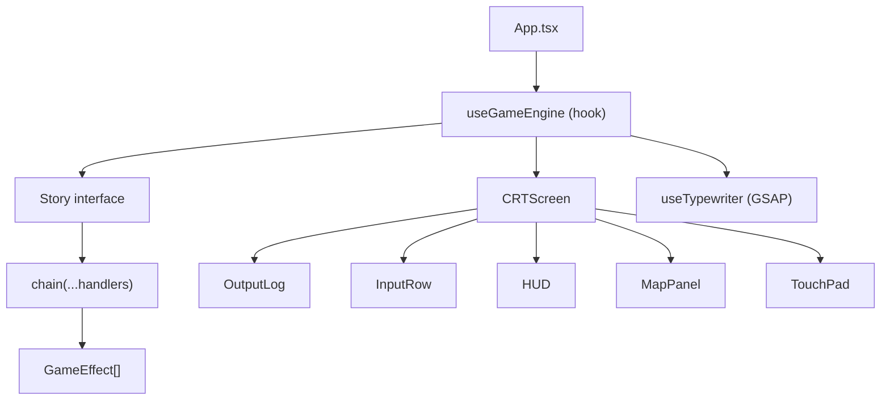

# lost-in-the-woods

Retro CRT text adventure game. Navigate a dark forest with typed commands before the vampire finds you. Phosphor-green terminal aesthetic with letter-by-letter typewriter output.

**Stack:** React **18**, Vite **6**, TypeScript **5**, GSAP **3**

---

## Prerequisites

- Node.js LTS
- pnpm

## Quick Start

1. `pnpm install`
2. `pnpm dev`
3. Open `http://localhost:5173`

## Commands

| Action           | Command              |
| ---------------- | -------------------- |
| Dev server       | `pnpm dev`           |
| Build            | `pnpm build`         |
| Preview build    | `pnpm preview`       |
| Run tests        | `pnpm test`          |
| Tests + coverage | `pnpm test:coverage` |
| Watch tests      | `pnpm test:watch`    |

## Architecture



**Story strategy pattern** — swap stories by implementing `Story` (src/stories/types.ts). Current story: `src/stories/lost-in-woods/`.

**Chain of responsibility** — `chain(...handlers)` in `handlers.ts` composes `CommandHandler` functions. Each returns `GameEffect[] | null` (null passes to next). Every command auto-prepends `INCREMENT_TURNS`.

**Pure effects** — handlers return data, engine applies. `GameEffect` union in `src/engine/types.ts`. State mutations apply to `stateRef` immediately so sequential effects see updated state.

**DevPanel** — renders only in `import.meta.env.DEV`. Autoplay paths from `story.paths`.

## Source Layout

```
src/
├── App.tsx
├── main.tsx
├── index.css
├── engine/
│   └── types.ts          # GameState, GameEffect union, OutputLine
├── hooks/
│   ├── useGameEngine.ts  # command dispatch, effect sequencer
│   └── useTypewriter.ts  # GSAP letter-by-letter animation
├── components/
│   ├── CRTScreen.tsx
│   ├── OutputLog.tsx
│   ├── InputRow.tsx
│   ├── HUD.tsx
│   ├── MapPanel.tsx
│   └── TouchPad.tsx
├── stories/
│   ├── types.ts          # Story interface
│   └── lost-in-woods/
│       ├── index.ts      # story export + paths
│       ├── handlers.ts   # command chain
│       ├── parser.ts     # input normalisation
│       └── maps.ts       # location map data
└── __tests__/
    ├── handlers.test.ts
    ├── parser.test.ts
    └── setup.ts
```

## Game Mechanics

| Detail         | Value                                               |
| -------------- | --------------------------------------------------- |
| Win condition  | Escape sequence `N N E N E S W N N E` in ≤ 25 turns |
| Vampire ending | > 25 turns elapsed                                  |
| Wrong step     | Silent reset — sequence restarts                    |